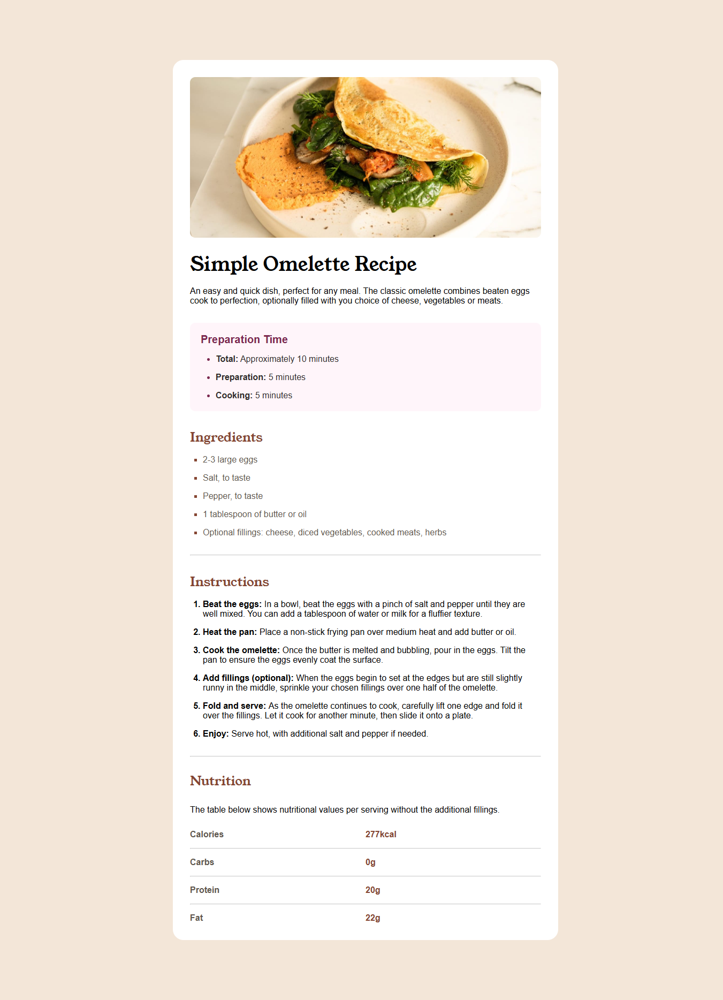

# 🍳 Simple Omelette Recipe Page

A clean, responsive recipe page built using HTML and CSS. This project is a solution to the [Frontend Mentor - Recipe page challenge](https://www.frontendmentor.io/challenges/recipe-page-KiTsR8QQKm), designed to improve frontend development skills with a real-world layout.

---

## 📸 Screenshot

---

## 🔗 Live Site

[Live Demo](https://mdismail13.github.io/recipe-page/)  
[Solution](https://github.com/mdismail13/recipe-page.git)

---

## 🛠️ Built With

- Semantic HTML5
- CSS Flexbox & Grid
- CSS Custom Properties (Variables)
- Mobile-first responsive design
- Google Fonts (Young Serif & Outfit)

---

## 💡 What I Learned

- How to build accessible and semantic HTML pages
- Using CSS custom properties for theming
- Creating mobile-friendly layouts with responsive units
- How to apply consistent spacing and visual hierarchy

---

## 🔄 Continued Development

In future projects, I’d like to explore:

- Advanced accessibility practices (ARIA labels, keyboard nav)
- Adding light/dark themes using CSS
- Animations and transitions for better UI

---

## 📚 Useful Resources

- [CSS Tricks – Flexbox Guide](https://css-tricks.com/snippets/css/a-guide-to-flexbox/)
- [MDN Web Docs](https://developer.mozilla.org/)
- [Frontend Mentor Discord Community](https://discord.gg/frontendmentor)

---

## 👨‍💻 Author

- Name - Md. Ismail  
- Frontend Mentor - [@mdismail13](https://www.frontendmentor.io/profile/mdismail13)  
- GitHub - [mdismail13](https://github.com/mdismail13)
- Facebook - [Ismail H. Emon](https://www.facebook.com/ismail.h.emon/)

---

## 🙌 Acknowledgments

Thanks to the Frontend Mentor community for inspiration, feedback, and support.
